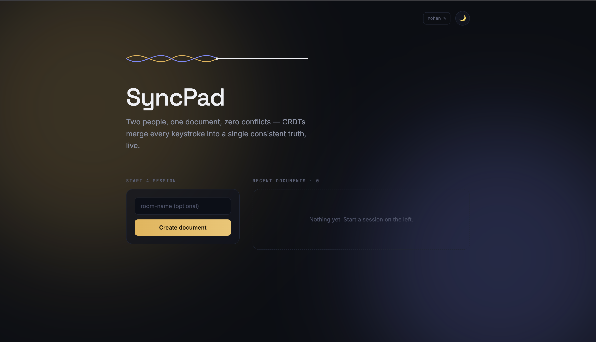

# SyncPad

A production-ready collaborative code editor built with the MERN stack that enables multiple users to edit the same document simultaneously. SyncPad uses **Yjs CRDTs** to synchronize edits in real time, ensuring conflict-free collaboration even when users type concurrently.

> Real-time collaboration • Conflict-free editing • Persistent documents • Live user presence

🌐 **Live Demo:** https://syncpad-dev.netlify.app/

---

## ✨ Features

- 🚀 Real-time collaborative editing powered by **Yjs CRDTs**
- 👥 Live user presence with colored cursors and name labels
- 💾 Automatic document persistence in MongoDB
- 📄 Create named rooms or generate random collaboration rooms
- 📂 Dashboard showing recently created documents
- 🌙 Light/Dark mode with system preference detection
- 👤 Editable display name stored locally
- 📡 Live connection status indicator
- ⚡ Zero page refresh synchronization

---

## 🏗️ Architecture

```
                +-----------------------+
                |     React Client      |
                |  CodeMirror + Yjs     |
                +-----------+-----------+
                            |
                     WebSocket (y-websocket)
                            |
                +-----------v-----------+
                | Express + ws Server   |
                |   Yjs Document Store  |
                +-----------+-----------+
                            |
                     MongoDB Persistence
```

**How a keystroke travels:** the editor converts each edit into a CRDT operation → broadcasts it over WebSocket → the server relays it to every other connected client for that room → each client merges the operation into its own local Yjs document automatically. The server also holds the canonical in-memory copy per room and periodically flushes its encoded state to MongoDB, so documents survive restarts and reconnects.

---

## 🛠 Tech Stack

**Frontend**
- React (Vite)
- React Router
- Tailwind CSS
- CodeMirror 6
- Yjs
- y-websocket
- y-codemirror.next

**Backend**
- Node.js
- Express.js
- MongoDB (native driver)
- ws
- y-websocket
- dotenv
- cors

---

## ⚙️ How It Works

1. User enters a display name (stored locally, no account required).
2. A new room is created or an existing room is joined via its link.
3. A shared **Yjs document** is initialized for that room.
4. Every edit is converted into CRDT operations, not raw text diffs.
5. Operations are broadcast to all connected clients over WebSocket.
6. Other clients merge incoming updates automatically — no locking, no manual conflict resolution.
7. The server persists the latest document state to MongoDB, so content survives disconnects and restarts.

Because SyncPad uses **Conflict-free Replicated Data Types (CRDTs)**, users can type simultaneously — even in the exact same spot — without merge conflicts or document locking.

---

## 📁 Project Structure

```
syncPad/
│
├── frontend/
│   ├── src/
│   │   ├── components/    # CollaborativeEditor, PresenceBar, ThemeToggle, etc.
│   │   ├── hooks/         # useYjsDoc, useTheme, useUserName, useOwnerId
│   │   ├── pages/         # Dashboard, EditorRoom
│   │   └── lib/           # color utilities
│   └── public/
│
├── backend/
│   ├── routes/
│   │   ├── root.js
│   │   └── api/docs.js    # room list + creation endpoints
│   ├── config/            # CORS allowlist
│   └── index.js           # Express + WebSocket + Yjs persistence
│
└── README.md
```

---

## 🔌 API

| Method | Endpoint | Description |
|--------|----------|-------------|
| GET | `/health` | Health check |
| GET | `/api/docs?ownerId=<id>` | Fetch documents created by this browser's owner ID |
| POST | `/api/docs/create` | Register a new room, tagging it with its creator's owner ID |

> Authentication is intentionally omitted in this version. Rooms are scoped to a browser-generated, anonymous `ownerId` stored in `localStorage` — good enough to keep each person's dashboard showing only their own rooms, without the overhead of real accounts.

---

## 🚀 Getting Started

### Clone the repository

```bash
git clone https://github.com/achyutranaut/syncPad.git
cd syncPad
```

### Backend

```bash
cd backend
npm install
```

Create a `.env` file:

```env
PORT=4000
MONGO_URI=mongodb+srv://<username>:<password>@<cluster>.mongodb.net/?retryWrites=true&w=majority
```

Run:

```bash
npm run dev
```

### Frontend

```bash
cd frontend
npm install
```

Create a `.env` file:

```env
VITE_API_URL=http://localhost:4000
VITE_WS_URL=ws://localhost:4000
```

Start:

```bash
npm run dev
```

---

## 📸 Screenshots

### Dashboard



---

## 🔮 Future Improvements

- User authentication (JWT/OAuth)
- Private and invite-only rooms
- Read-only and editor permissions
- Version history with Yjs snapshots
- Multi-language support (currently JavaScript only)
- Markdown & rich-text support
- Integrated chat/comments
- Rate limiting
- Docker deployment
- CI/CD pipeline
- Horizontal scaling using Redis Pub/Sub
- Unit and integration testing

---

## 🤝 Contributing

Contributions are welcome.

1. Fork the repository
2. Create a feature branch
3. Commit your changes
4. Open a Pull Request

---

## 📄 License

This project is licensed under the MIT License.

---

## 👨‍💻 Author

**Achyut Ranaut**
GitHub: https://github.com/achyutranaut