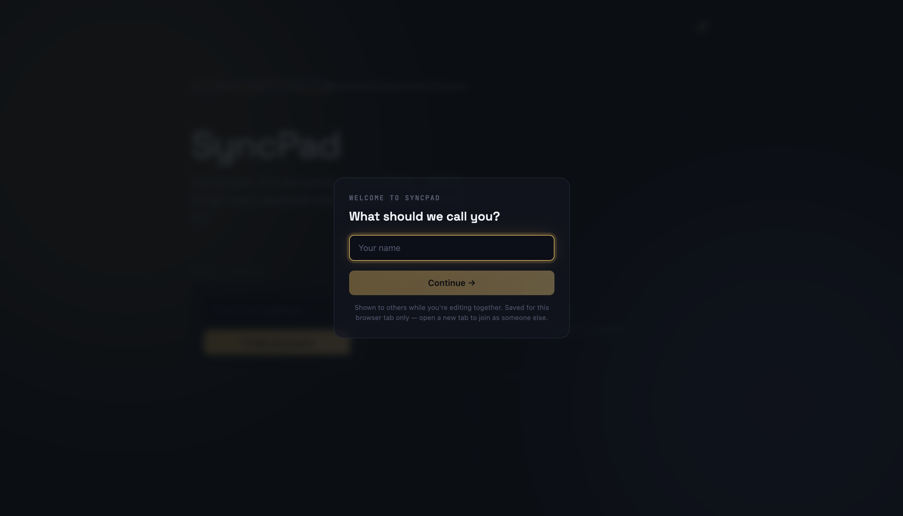
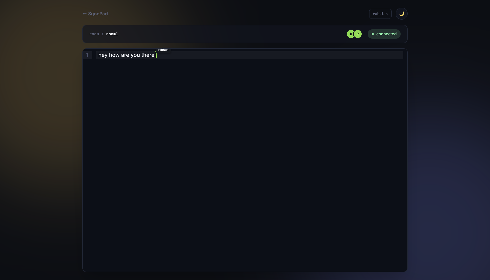
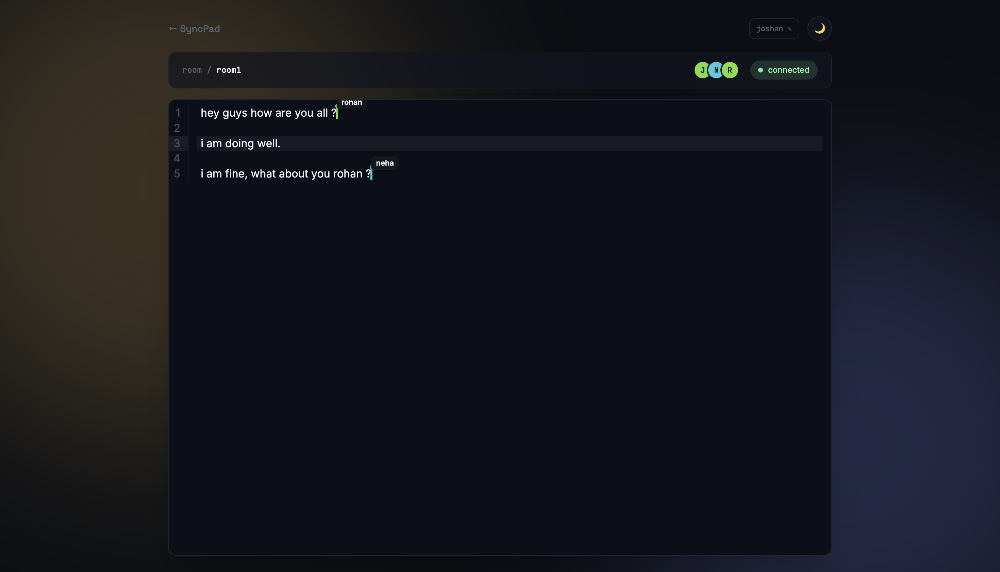
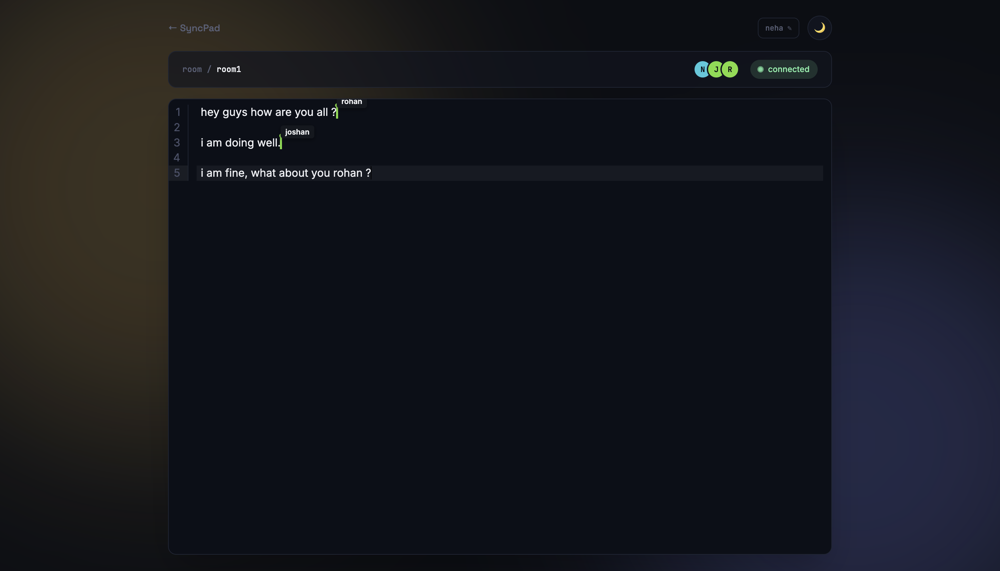

# SyncPad

A production-ready collaborative code editor built with the MERN stack that enables multiple users to edit the same document simultaneously. SyncPad uses **Yjs CRDTs** to synchronize edits in real time, ensuring conflict-free collaboration even when users type concurrently.

> Real-time collaboration • Conflict-free editing • Persistent documents • Live user presence

🌐 **Live Demo:** https://your-netlify-url.netlify.app

---

## ✨ Features

- 🚀 Real-time collaborative editing powered by **Yjs CRDTs**
- 👥 Live user presence with colored cursors and name labels
- 💾 Automatic document persistence in MongoDB
- 📄 Create named rooms or generate random collaboration rooms
- 📂 Dashboard showing recently created documents
- 🌙 Light/Dark mode with system preference detection
- 👤 Editable display name stored locally
- 📡 Live connection status indicator
- ⚡ Zero page refresh synchronization

---

## 🏗️ Architecture

```
                +-----------------------+
                |     React Client      |
                |  CodeMirror + Yjs     |
                +-----------+-----------+
                            |
                     WebSocket (Y-WebSocket)
                            |
                +-----------v-----------+
                | Express + ws Server   |
                |   Yjs Document Store  |
                +-----------+-----------+
                            |
                     MongoDB Persistence
```

---

## 🛠 Tech Stack

### Frontend

- React (Vite)
- React Router
- Tailwind CSS
- CodeMirror 6
- Yjs
- y-websocket
- y-codemirror.next

### Backend

- Node.js
- Express.js
- MongoDB (Native Driver)
- ws
- y-websocket
- dotenv
- cors

---

## ⚙️ How It Works

1. User enters a display name.
2. A new room is created or an existing room is joined.
3. A shared **Yjs document** is initialized.
4. Every edit is converted into CRDT operations.
5. Operations are broadcast through WebSockets.
6. Other clients merge updates automatically.
7. The server periodically stores the latest document state in MongoDB.

Because SyncPad uses **Conflict-free Replicated Data Types (CRDTs)**, users can type simultaneously without merge conflicts or document locking.

---

## 📁 Project Structure

```
syncPad/
│
├── frontend/
│   ├── src/
│   ├── public/
│   └── ...
│
├── backend/
│   ├── routes/
│   ├── websocket/
│   ├── db/
│   └── ...
│
└── README.md
```

---

## 🔌 API

| Method | Endpoint | Description |
|---------|----------|-------------|
| GET | `/health` | Health check |
| GET | `/api/docs?ownerId=` | Fetch user's recent documents |
| POST | `/api/docs` | Create a new document |

> Authentication is intentionally omitted in this version. Documents are currently isolated using a browser-generated session `ownerId`.

---

## 🚀 Getting Started

### Clone the repository

```bash
git clone https://github.com/achyutranaut/syncPad.git
cd syncPad
```

---

### Backend

```bash
cd backend
npm install
```

Create a `.env` file:

```env
PORT=4000
MONGO_URI=mongodb+srv:

Run:

```bash
npm run dev
```

---

### Frontend

```bash
cd frontend
npm install
```

Create a `.env` file:

```env
VITE_API_URL=http://localhost:4000
VITE_WS_URL=ws://localhost:4000
```

Start:

```bash
npm run dev
```

---

## 📸 Screenshots

### Dashboard




### Collaborative Editor



### Live Presence




## 🔮 Future Improvements

- User authentication (JWT/OAuth)
- Private and invite-only rooms
- Read-only and editor permissions
- Version history with Yjs snapshots
- Markdown & rich-text support
- Integrated chat/comments
- Rate limiting
- Docker deployment
- CI/CD pipeline
- Horizontal scaling using Redis Pub/Sub
- Unit and integration testing

---

## 🤝 Contributing

Contributions are welcome.

1. Fork the repository
2. Create a feature branch
3. Commit your changes
4. Open a Pull Request

---

## 📄 License

This project is licensed under the MIT License.

---

## 👨‍💻 Author

**Achyut Ranaut**
GitHub: https://github.com/achyutranaut